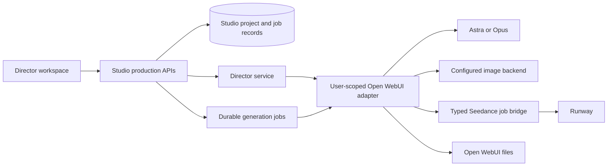

# Studio Director implementation plan

Status: implementation baseline, 26 September 2026. The Director workspace and an opt-in structured mode for the Runway pipe are now implemented in source. See [setup and delivered scope](director-setup.md) for activation, tested behaviour and remaining limits. Deployment and paid live-provider verification have not been performed.

## Product decision

Extend the existing Open WebUI Studio companion with a Director workspace at `/studio/director`. Director is the working product name for visual storytelling across film, television and other screen formats. Keep the existing Agents, Media and Flows experiences. Director presents projects, references, shots and takes directly; users do not need to build a flow graph to create a sequence.

Use **Director** for the navigation label and **Studio Director** when naming the product in full. Individual productions are **Projects**, with **Sequences**, **Shots** and **Takes** inside them. Label the assistant panel **Assistant** to distinguish the workspace from its AI support. Production format is optional project metadata (for example film, TV episode, trailer, promo or other); it does not change the core workflow. Series/season organisation can be added later without making it mandatory for standalone projects.

The first release must support one complete production: enter a brief, draft and edit a shot list, establish character references, generate or edit frames, generate Seedance clips with requested dialogue and sound, accept takes, preview the sequence, and export the accepted media with a production manifest.

Assumptions: private projects owned by one Open WebUI user initially; desktop-first layout with usable narrow-screen panels; user-selected Astra or Opus as Director; GPT Image 2.5 as the desired image backend; the user's existing Seedance 2.5 Runway pipe remains available. Actual model IDs and supported inputs are discovered from the deployment rather than inferred from display names.

## What exists and what must change

| Area                | Observed in the checkout                                                              | Implementation consequence                                                                             |
| ------------------- | ------------------------------------------------------------------------------------- | ------------------------------------------------------------------------------------------------------ |
| Application         | SvelteKit, Svelte, TypeScript, adapter-node                                           | Extend this app and its conventions                                                                    |
| Identity            | OIDC, encrypted sessions, user-scoped Open WebUI adapter                              | Reuse identity and access checks                                                                       |
| State               | Independent SQLite database and numbered migrations                                   | Add production records here                                                                            |
| Media               | Open WebUI file listing and authenticated previews                                    | Keep durable media in Open WebUI; store references in Studio                                           |
| Images              | Generation/edit APIs, uploads, sketch references, output persistence                  | Extract reusable image services/components from flow-specific use                                      |
| Image selection     | Current API uses the globally configured image backend                                | Verify GPT Image 2.5 is configured; per-project provider switching needs an explicit adapter extension |
| Executions          | Versioned flows, encrypted payloads, claims, heartbeats, events and credential leases | Reuse lifecycle conventions; add durable provider task reconciliation                                  |
| Text calls          | `completeText` excludes workspace presets/functions and accepts only a text prompt    | Add a separate typed Director method; preserve the existing text-flow contract                         |
| Video               | No typed video-generation adapter or production entities                              | Add these as new capabilities                                                                          |
| Integration version | Studio adapter describes v0.10.2; adjacent Open WebUI package is v0.11.3              | Contract-test the actual deployment before relying on newer API behaviour                              |

The Studio README references `docs/owui-studio-contract.md` in the adjacent repository, but it was not present in the inspected stage checkout. Write down the verified integration contract as part of the first phase.

## User experience

### Project library and setup

Create, rename, duplicate or archive a project. Capture brief, production format, intended audience, style, aspect ratio, target runtime, language and model selections. Display provider readiness without making a paid call. Duplication copies the production plan and asset references, with access revalidated; it does not resubmit jobs.

### Director workspace

- Left: brief, characters, locations and ordered shots.
- Centre: storyboard cards, or the selected shot's frame/video viewer.
- Right: shot settings or an Assistant conversation scoped to the project and selected shots.
- Bottom: sequence strip showing accepted takes, duration and missing shots.

Use tabs/drawers on smaller screens. Provide keyboard alternatives to dragging, labelled controls, visible focus, text status indicators, reduced motion and caption/transcript display when available.

### References

Create characters with names, appearance, wardrobe and voice descriptions. Assign images explicit roles: identity, wardrobe, location, prop, style, first frame or last frame. Save accepted reference versions. A character sheet is a review artefact; individual reference views are separately selectable for generation. Upload existing material or generate/edit it through the image integration.

### Storyboard and shot editor

Each shot has a stable ID independent of its order. Editable fields include intention, framing, action, camera movement, setting, lighting, duration, characters, continuity notes, first/last frames, dialogue speaker/text/delivery, ambience, effects and music direction. Separate creative instructions from provider settings.

Actions: draft shots from brief; insert/duplicate/reorder; generate first frame; generate optional last frame; generate close-up; edit selected frame; compile video prompt; generate a take; compare; accept; revise.

Show readiness per operation. Missing references should block only operations that require them. Preserve accepted outputs when a brief or reference changes, and flag affected shots as needing review rather than silently regenerating them.

### Takes and sequence

Every generation creates a new immutable take with its submitted inputs. Selecting a take for the sequence changes the shot's accepted-take reference, not the media itself. Compare frames side by side and videos with explicit playback controls. Store human review notes and optional assisted review findings separately.

Preview accepted takes in shot order, indicating gaps. The first export is an ordered asset bundle plus JSON manifest and human-readable shot list. Browser playback is a sequence preview, not a frame-accurate final render. A later finishing phase adds a downloadable rough-cut MP4 and trims with a media-processing worker.

## Architecture and ownership

Studio owns project state, revisions, shot ordering, job metadata, review notes and accepted-take choices. Open WebUI remains authoritative for users, permissions, model access, provider configuration and files. Studio must not read the Open WebUI database or import its internal classes. Use the existing server adapter and keep credentials off the browser.

Extract reusable media and execution services only where Director needs them. Do not encode every production project as a hidden Flow definition, and do not rewrite the working Flow engine first. Production jobs can have dedicated records while sharing credential, claim, event and adapter infrastructure. Preserve old flow definitions and tests.

SQLite is sufficient for the first deployment with a single host and controlled workers. Multiple hosts sharing one SQLite file are outside the initial deployment model.

## Director, skills and generation boundaries

Provide a scoped Director service that accepts the project revision, selected shot IDs, relevant asset metadata and requested operation. Start with bounded operations: draft storyboard, revise selected shots, write frame prompts, compile Seedance prompt and review supplied evidence.

Use four versioned instruction packs: screen production planning; character/frame design; Seedance directing; continuity/review. Adapt the existing Seedance skill to verified Runway capabilities. Keep the source text in version control and optionally publish equivalent Open WebUI skills from that source. Snapshot the instruction version for each operation. Do not assume API calls automatically load the same skills or built-in tools as Open WebUI's chat UI.

Director responses propose schema-validated changes with a base project/shot revision. Show the proposed changes before applying them; support undo. A user request to draft a plan may execute text generation, while image/video generation is a separate explicit action or explicitly requested batch. The model never directly writes the database or submits arbitrary provider requests. A later free-form tool loop must call the same bounded application commands.

Add a Director adapter for supported models/presets, message context and structured output where available. Validate JSON server-side even with provider schema support. Permit one bounded text-only repair for invalid output, then show an editable failure. Do not remove restrictions from the existing `completeText` method to enable every pipe globally. The v1 fallback is a base text model plus explicit instruction packs if preset behaviour is not verified.

Filters are optional for contextual defaults. Required validation, job lifecycle and access checks belong in services. No filter should silently initiate a paid generation.

## Seedance integration contract

At planning time the checked-in `runway_inline.py` was an older single-image/Gen-4-oriented implementation. During implementation the user supplied the current 3.0.0 source, confirming Seedance 2.5, native audio and one first-frame input. Version 3.1.0 adds structured capabilities, submit and status commands to that pipe; the deployed function still needs updating. Its input limits and durable job mapping are documented in the setup guide.

Preferred integration: retain the selectable pipe and share its Runway implementation with a narrow authenticated job bridge deployed alongside Open WebUI. Studio calls the bridge through its user-scoped adapter. The bridge owns model access checks, credentials, accepted media resolution and task ownership. Its exact packaging is settled after inspecting the installed function; Studio must not start depending on private Python imports or scraping rendered chat HTML.

Proposed bridge operations, not claims about existing endpoints:

- `capabilities`: supported model/modes, input roles, legal combinations, settings, audio options and cancellation support.
- `submit`: client submission ID plus immutable shot specification; return bridge job ID and provider task ID when known.
- `status`: return state, errors and durable output file references, bound to the requesting user.
- `cancel`: request provider cancellation when supported and report its actual outcome.

Generation requests include explicit assets by ID and role, prompt, duration, aspect/size settings and only supported audio/reference controls. Validate combinations against the installed model's capabilities. Do not assume first/last frames, supplementary character references and audio references can all be combined in one request.

Resolve private Open WebUI assets on the server into provider-supported uploads or data payloads. Never send a private `/api/v1/files/...` URL and assume Runway can access it. Persist outputs into Open WebUI files before marking delivery complete; temporary provider URLs are not durable asset IDs.

If the installed pipe already offers stable structured task submission/status, wrap that contract instead of introducing another bridge. If it only blocks until it returns a video, upgrade the integration before promising restart-safe generation. A successful chat rendering is not sufficient evidence of that capability.

## Persistence and job semantics

Proposed entities:

| Entity                 | Essential contents                                                                                           |
| ---------------------- | ------------------------------------------------------------------------------------------------------------ |
| Production project     | Owner, brief, production format, settings, model references, revision, archived state                        |
| Subject/reference      | Character/location/prop identity, descriptions, accepted reference version                                   |
| Asset binding          | Open WebUI file ID, role, subject, provenance and version                                                    |
| Shot and shot revision | Stable ID, order, creative specification, reference bindings, revision                                       |
| Take                   | Shot revision, input snapshot, prompt, models/settings/instruction versions, output IDs, review state        |
| Generation job         | Owner, take, operation, idempotency key, input hash, provider/bridge IDs, claim, state, timestamps and error |
| Review                 | Take, author or reviewing model, evidence references, findings and decision                                  |
| Sequence/export        | Ordered accepted take IDs, revision, export state and output references                                      |
| Director operation     | Scoped request, base revision, proposed changes, model/instruction version and apply state                   |

Use optimistic concurrency for edits and atomic updates for take acceptance. Composite ownership checks must prevent linking another user's shot, job or asset. Revalidate file/model access at use time. Store sensitive prompts and generation snapshots using the existing encryption conventions; progress events carry metadata rather than credentials or full prompts.

Job states: queued, submitting, submitted, running, importing, succeeded, failed, cancel-requested, cancelled and submission-unknown. Persist submission intent before contacting the provider and persist returned task IDs immediately. The bridge keeps the client submission mapping durably.

Browser disconnects do not cancel jobs. Known submitted jobs resume status checks after restart. Read-only status checks and output imports may retry with backoff; generation submissions may not be blindly retried. A network failure after remote acceptance but before receipt of the task ID is inherently ambiguous unless the provider supports idempotent submission or reconciliation: mark submission-unknown and surface recovery rather than claim exactly-once execution.

Separate execution timeout from provider failure and cancellation from proven provider cancellation. If credentials expire, preserve known task IDs and require reauthentication before continuing access. Import failure must retry output retrieval without rerendering. Late results must be attached to the correct immutable take even if its shot has since changed.

Use bounded per-user/global concurrency. Batch jobs capture the selected shots and settings at submission. Cancelling a batch stops queued work and requests cancellation for submitted jobs. Show usage/cost only when sourced from a verified price configuration or actual provider usage; otherwise label it unavailable. Do not invent progress percentages.

## Delivery sequence

| Phase                             | Work                                                                                                                                          | Exit criterion                                                                                                                                                |
| --------------------------------- | --------------------------------------------------------------------------------------------------------------------------------------------- | ------------------------------------------------------------------------------------------------------------------------------------------------------------- |
| 0. Verify integration             | Inspect deployed model IDs/pipe; contract-test OWUI version, Director access and image configuration; define video bridge/capability contract | A documented request/result contract, representative fixtures and an agreed deployment path; no assumptions hidden in UI code                                 |
| 1. Project records and storyboard | Migrations, project library, brief, character/reference library, shot CRUD/order, revision checks and workspace shell                         | Create and reload a three-shot project with persistent references and editable shot cards                                                                     |
| 2. Director and frames            | Versioned instruction packs, scoped structured proposals, apply/undo, reusable image APIs, first/last-frame and close-up generation           | Turn a brief into editable shots; generate and accept a character reference and shot frames using the configured image backend                                |
| 3. Seedance vertical slice        | Typed bridge, video adapter, jobs, persistence, progress, output import, playback and take acceptance                                         | Generate one shot with requested speech/sound; refresh and restart during its known task lifecycle without creating another submission; accept its saved take |
| 4. Complete first release         | Take comparison, targeted revisions, stale-reference flags, selected-shot batches, sequence preview, ordered asset/manifest export            | Produce and export a three-shot sequence; regenerate shot 2 without rerunning accepted shots 1 and 3                                                          |
| 5. Finishing and assisted review  | Media worker for rough-cut MP4, boundary-frame extraction, optional transcripts/audio checks, evidence-based model review                     | Export a playable assembled rough cut with audio; review claims identify the actual media evidence examined                                                   |

Phase 0 determines the integration effort. Give a delivery estimate after it; the current source does not establish whether the installed pipe already supports durable jobs. Phases 1-4 are the first release. Phase 5 is a separately scoped enhancement.

## Implementation map

Proposed additions under the current repository:

- `src/routes/director/` and `src/routes/director/[id]/`: project library and production workspace.
- `src/routes/api/director/`: project, shot, reference, Director proposal, job, take and export endpoints.
- `src/lib/director/`: shared domain types, validation and readiness derivation.
- `src/lib/components/director/`: storyboard, reference picker, shot editor, Director panel, take comparison and sequence preview.
- `src/lib/server/director/`: persistence, command handlers, Director service, orchestration and exports.
- `src/lib/server/owui/`: additive Director, capability and video-job contracts and adapters.
- `src/lib/server/media/`: shared media operations extracted from flow-only entry points as needed.
- `migrations/`: additive numbered migrations after the current sequence.
- `tests/director.e2e.ts`: deterministic end-to-end workflow using mock integrations.

Any Open WebUI-side bridge change is a separate, versioned integration deliverable with its own contract tests. Do not couple Studio releases to undocumented response HTML or database layouts.

## Verification and release

Use deterministic provider stubs for normal development and CI. Test user isolation; revision conflicts; malformed Director output; input-role validation; double-click submissions; ambiguous submission failures; worker restart after task acceptance; late completion; expired credentials; failed output import; cancellation; missing files; and selective rerendering. Test database migrations and old flow execution as well.

Browser acceptance: create brief, obtain a mock shot proposal, edit/reorder, assign references, generate frames and video, reload during progress, compare/accept takes, preview sequence and export. Include keyboard use, narrow-screen panels, media errors and reconnecting progress events.

Run the repository's relevant integration suite, Svelte check, lint and build, plus the new Director browser suite and existing image-flow browser regression. Planning does not run paid generation. Before release, perform a deliberately requested small live smoke test against the configured models, validating generated speech/sound by playback rather than still images alone.

Keep Director behind a feature flag during development. Roll out to the owner first, then intended users after the three-shot acceptance workflow passes. Preserve project/job records on rollback; never cancel or resubmit existing provider tasks merely because the UI version changes.

## Deferred scope

Full nonlinear editing, frame-accurate timeline controls, separate audio stems, advanced mixing, collaborative editing, public sharing, arbitrary user-authored agent workflows and unrestricted autonomous batch generation are outside the first release. Native shot audio does not guarantee matching voices or levels across clips; the review UI must make those differences easy to hear.

## Reference sources

Repository evidence: Studio `README.md`, `src/lib/server/owui/client.ts`, `src/lib/server/owui/contracts.ts`, `src/lib/server/flows/worker.ts`, `src/lib/server/flows/executions.ts`, `src/lib/flows/types.ts` and the migrations. The adjacent stage checkout supplies the older `functions_tools/functions/runway_inline.py`, image pipes, and current Open WebUI middleware for comparison. Deployment behaviour remains to be verified.

- [Open WebUI API endpoints](https://docs.openwebui.com/reference/api-endpoints/): model discovery, completions and API tool integration. Verify version compatibility rather than assuming latest documentation matches the running server.
- [Runway API reference](https://docs.dev.runwayml.com/api/): generation, task status, cancellation and uploads.
- [Runway input documentation](https://docs.dev.runwayml.com/assets/inputs/): provider input transport and model-specific constraints.
